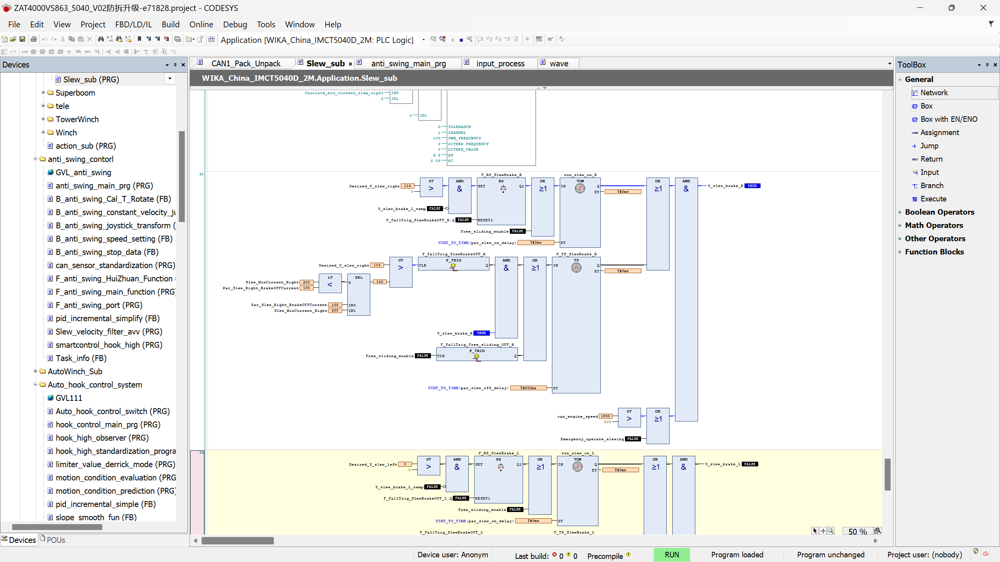

## edit:
1. add folder `TangJinfeng`;
2. add program `wave`;
3. modify `Slew_sub` for test_mode;
4. modify `real_to_uint` with two steps(`int`), in `hook_control_main_prg`

### note:
- `XH`, `XL` no scale effect in `occ`;
- do not typo again `array_par_read` vs `array_par_write`;

### codesys bug:
- `real_to_uint` : negative value result is 0 in `FBD`;
- `dot` or `box` : for program, `box` must occur only once, at least once;
- 当动卷扬时，未沟通刷入控制器程序，会导致吊钩持续上升（控制器维持变量的状态）。

### program `wave`

#### 目的：
1. 在按下按键 时，向右摆动左手柄（超过50），启用自动回转测试；
2. 回转测试发送正弦波或三角波的值 `Con_Joystic_Out_Slew` ，发送持续 T 秒，自动退出测试模式。
3. 正弦波为半周期，周期为 `2*T` 秒。波高为 `650`，有效值为 `650*0.7=455`。

#### 逻辑：
* 按键按下（第三行第三个），进入测试模式，禁用左手柄控制回转。
* 只有再次按下按键，才退出测试模式（不接受发送的正弦波），~~回转刹车~~；
* 自动退出测试模式，也将~~回转刹车~~。

* 没有按下按键时，定时器不断重置，不会发送正弦波。
* 按下按键后，左手柄值小于50，不会发送正弦波。
* 按下按键后，左手柄值向右大于50，开始发送正弦波。
* 当开始发送正弦波后，将不再依赖左手柄值是否大于50；
* 当开始发送正弦波后，将持续 T 秒。
* 若手柄始终大于 50，那么将持续发送波形，直到手柄小于50后 的一个完整波形结束， 或直接退出测试。
* 左回转同理，要求手柄值小于 -50。
* 当左手柄值在大于50和小于-50之间来回切换时，每次根据回转方向，从零开始发送波形。
* 在自动退出测试模式前，可以继续发送某一方向的波形控制回转。
* 将手柄始终置于大于50，可以持续回转。

#### 逻辑总结：
* 测试发送回转，需要按键 + 手柄，但不需要保持手柄。
* 退出测试，自动退出测试模式或按下按键。
* 自动退出测试模式后，会自动灭灯，再次按下。

### test `wave`

#### bug
1. 刹车代码如上图，`wave`的切入，导致测试模式下无法制动，只能自由滑行。
2. 左右回转动作后，退出测试模式，此时制动缸全为`True`，无法手动回转。
解决办法为：进入测试模式后，快速小幅度左右抖动手柄（500ms 内从100 降到0）。
3. 进入测试模式后，左转时，制动缸为`True`，表示允许左转；当将落从100到0时，制动缸为`False`，表示启用制动。