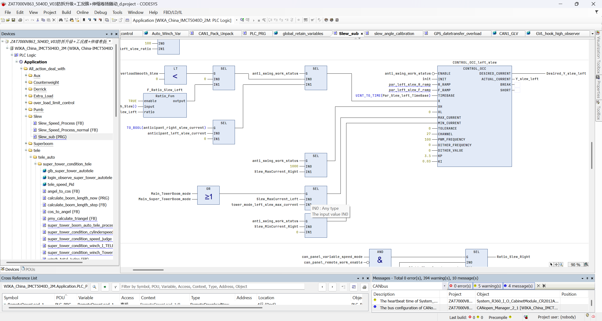

~~add sentence `array_Tx_1A1[3].4:=hook_high_standardization_failure;(*吊载平移新增*)`  at `min_current_RX_TX`~~

临时商议修改至38C
```
(*智能吊载平移新增*)
array_Tx_38C[2].2:=can_goal_high_error;
array_Tx_38C[2].3:=can_boom_stable_error;
array_Tx_38C[2].4:=hook_high_standardization_failure;  // (*20240220 吊载平移修改报文 by 唐金峰*)
// array_Tx_1A1[3].4:=hook_high_standardization_failure;  // (*吊载平移初始报文*)
(**)
```

纠正野生变量
```
rope_length_theory_standardization_sub:REAL;(*控制器保存的钢丝绳长度损耗值，20241226 纠正野生retain变量 by 唐金峰*)
```

吊钩高度观测挪出吊载平移

更改防摇摆1期的臂架质量、臂架刚度以及回转速度-电流值的拟合a、b值。

add
```
can_limiter_boom_head_height:=UINT_TO_REAL(array_Rx_limiter_18E[7]+array_Rx_limiter_18E[8]*256)/10.0;(*吊载平移用 by 00744058*)
```


修正 `slew_sub` 中，左右回转全部使用 `right`

